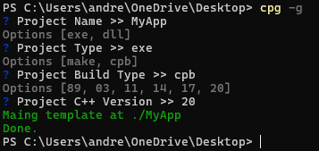
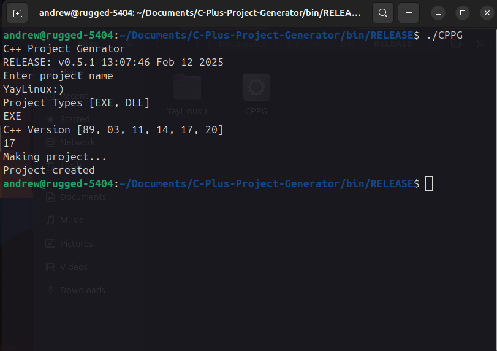

# C-Plus-Project-Generator
Simple command-line tool for creating c++ projects with full folder structure and makefile. I know it might not be the most up to date way of doing things but it works for me.

## Build Status
| Platform           | Supported |
| :----------------- | :-------- |
| `Linux (x86_64)`   | Yes       |
| `macOS (arm64)`    | No        |
| `Windows (x86_64)` | Yes       |

## Uesage
Example Screenshot

windows

linux

